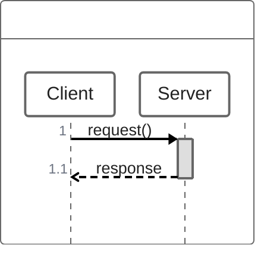

## 1. 📄 작업 내용 (Summary & Intent)

- 작업 진행 상황에 대한 구체적인 구현은 언급하지 않고, 어떤 비즈니스 문제를 해결하는 것인지 기술합니다.
- 리팩토링 작업일 경우, 기존에 어떠한 점들이 불편했고, 이것들을 어떻게 개선했는지 기술합니다.
- 예시 코드도 간단하게 첨부 가능합니다.

## 2. 🤔 기술적 의사결정 및 대안 (Alternatives & Trade-offs)

- 해결하고자하는 비즈니스 문제는 무엇이었고, 이를 해결하기 위한 여러가지 방법들 중에서 왜 이 방법을 택했는지
- 이 방법의 장, 단점은 무엇이고 이것을 왜 선택했는지
- 만약 기술 부채로 남겨둔다면, 추후에 어떤 방향성으로 개선하면 좋을지

## 3. 🏗️ 전체 흐름 및 아키텍처

여기에는 전체 서비스 흐름을 너무 디테일하지는 않게끔, 전반적인 흐름을 기술합니다.

필요하다면 다이어그램을 삽입합니다.

## 4. 🔗 연관 작업 (Related Tasks)

여기는 github 의 commit, PR tag와 소제목들을 표기합니다.

## 5. ✅ 테스트 계획 및 결과 (Testing Plan)

여기는 하위 항목과 같이, 자신이 수행했던 테스트 플랜을 작성합니다.

누락되는 테스트를 방지하기 위함입니다.

테스트 코드가 있을 경우 레퍼런스를 기입합니다.

- [ ] Unit Test 작성 및 통과 - `ServiceTest.java`참고
  - [ ] Swagger/Postman을 이용한 API 테스트 (스크린샷 첨부 가능)

## 6. ⚠️ 영향 범위 및 Breaking Changes (Impact Analysis)

예상되는 Side effect를 관리하기 위함입니다. 단순 file diff가 아닌 의미론적으로 접근해주세요.

- [ ] DB Schema Migration 필요 (`flyway`, `liquibsae` 등)
- [ ] 환경 변수(`.env`) 추가/수정 필요
- [ ] API Request/Response 규격 변경 (FE 연동 주의)

## 7. 💬 리뷰어에게 요청하는 점 (To Reviewers)

여기는 자유롭게 기재합니다.

리뷰어들이 어떤 점에 집중해서 리뷰해주었으면 좋겠는지 기술합니다.
