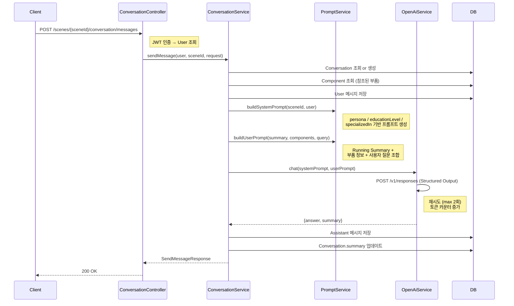
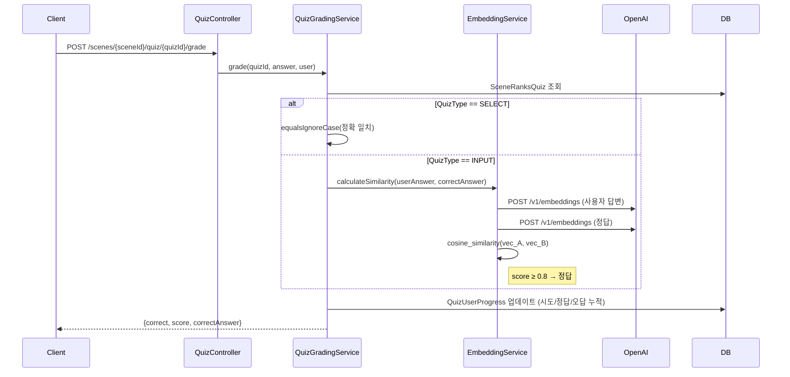
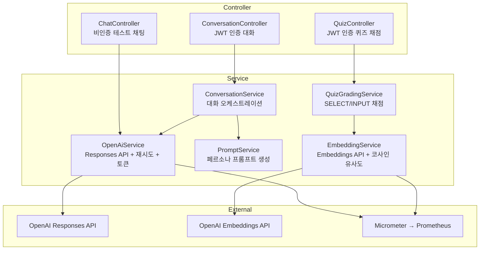

# feat(ai): AI 기능 통합 — 채팅, 퀴즈 채점, 페르소나 프롬프트, 토큰 모니터링

---

## 1. 📄 작업 내용 (Summary & Intent)

### 해결하려는 비즈니스 문제

SIMVEX는 3D 공학 부품을 시각적으로 탐색하는 학습 플랫폼입니다. 기존에는 사용자가 부품 정보를 **정적 텍스트**로만 확인할 수 있었고, 모르는 개념이 있으면 외부 검색에 의존해야 했습니다.

이번 작업은 다음 4가지 문제를 해결합니다:

**① "이 부품이 뭔지 물어볼 곳이 없다"**
- 사용자가 3D 모델의 특정 부품을 클릭하고 "이게 뭐야?", "왜 이 재질을 썼어?"라고 바로 질문할 수 있는 **씬 기반 AI 대화**를 추가했습니다.
- 부품(Component)을 참조하며 질문하면, AI가 해당 부품의 이름/재질/용도 정보를 맥락에 포함시켜 답변합니다.

**② "설명이 너무 어렵다 / 너무 쉽다"**
- 모든 사용자에게 동일한 톤의 답변을 제공하면, 입문자에게는 전문 용어가 벽이 되고, 전문가에게는 설명이 유치하게 느껴집니다.
- **사용자 프로필**(페르소나, 학력 수준, 전공)에 따라 AI의 어조와 설명 수준이 자동으로 조정되는 **개인화 프롬프트 시스템**을 구축했습니다.

**③ "퀴즈 정답 채점이 키워드 일치뿐이다"**
- 기존 SELECT(객관식) 퀴즈는 정확 일치로 채점 가능하지만, INPUT(서술형) 퀴즈는 "같은 의미인데 표현이 다른" 답변을 오답 처리하게 됩니다.
- OpenAI Embedding API를 활용한 **의미 기반 유사도 채점**을 도입하여, 표현이 달라도 의미가 같으면 정답으로 인정합니다.

**④ "AI 비용을 모니터링할 수 없다"**
- OpenAI API는 토큰 단위 과금이므로, 사용량 추적 없이 운영하면 비용 폭증 위험이 있습니다.
- 모든 API 호출의 토큰 소모량을 **Micrometer Counter**로 수집하여, Prometheus/Grafana에서 실시간 모니터링할 수 있도록 했습니다.

---

## 2. 🤔 기술적 의사결정 및 대안 (Alternatives & Trade-offs)

### 2-1. OpenAI API 호출: Spring AI vs RestClient 직접 호출

| 방식 | 장점 | 단점 |
|------|------|------|
| **Spring AI SDK** | 자동 설정, 추상화, ChatClient 제공 | 버전 불안정 (M5), Responses API 미지원, 의존성 무거움 |
| **RestClient 직접 호출** ✅ | 가볍고 제어 가능, Responses API 직접 사용, 디버깅 용이 | 요청/응답 DTO 직접 작성, 재시도 로직 직접 구현 |

**선택 이유**: OpenAI가 2025년 이후 Responses API(`/v1/responses`)를 메인으로 전환했지만, Spring AI SDK가 아직 이를 지원하지 않습니다. RestClient로 직접 호출하면 Structured Output(JSON Schema 강제)도 자유롭게 설정 가능합니다.

**기술 부채**: Spring AI가 Responses API를 정식 지원하면 마이그레이션 검토 가능. 현재 `OpenAiService`와 `EmbeddingService`에 API 호출이 캡슐화되어 있어 교체 영향 범위가 제한적입니다.

### 2-2. 대화 맥락 관리: Full History vs Running Summary

| 방식 | 장점 | 단점 |
|------|------|------|
| **전체 대화 기록 전송** | 맥락 손실 없음 | 토큰 비용 O(n) 증가, context window 초과 위험 |
| **Running Summary** ✅ | 토큰 비용 O(1), context window 문제 없음 | 요약 과정에서 디테일 손실 가능 |

**선택 이유**: 학습 대화 특성상 최근 맥락이 중요하고, 과거 디테일이 필수적이지 않습니다. 매 응답에서 AI가 `summary` 필드로 핵심을 요약하고, 다음 요청에 이 요약만 포함시킵니다. 토큰 효율성이 핵심이었습니다.

**기술 부채**: 복잡한 다회차 학습에서 맥락 손실이 문제되면, 최근 N개 메시지 + Running Summary 하이브리드 방식으로 개선 가능합니다.

### 2-3. 서술형 퀴즈 채점: 키워드 매칭 vs Embedding 유사도

| 방식 | 장점 | 단점 |
|------|------|------|
| **키워드 매칭** | API 호출 불필요, 빠름 | "같은 의미, 다른 표현" 오답 처리 |
| **LLM 직접 채점** | 유연한 평가 | 느리고 비쌈, 할루시네이션 위험 |
| **Embedding 코사인 유사도** ✅ | 의미 기반 비교, 빠르고 저렴, 결정적 결과 | 임계값 튜닝 필요 |

**선택 이유**: Embedding은 LLM 직접 채점 대비 10배 이상 저렴하고, 동일 입력에 동일 결과를 반환하므로 재채점 시 일관성이 보장됩니다.

**임계값 `0.8`**: text-embedding-3-small에서 의미적으로 동일한 문장 쌍의 유사도가 0.85~0.95 범위에 분포합니다. 0.8로 설정하면 표현 차이를 허용하면서도 완전히 다른 답변은 걸러냅니다. 운영 데이터가 쌓이면 조정이 필요할 수 있습니다.

### 2-4. 토큰 모니터링: DB 저장 vs Micrometer Counter

**Micrometer란?** Spring Boot에 내장된 메트릭 수집 라이브러리입니다. 애플리케이션 내부의 수치(요청 수, 응답 시간, 토큰 소모량 등)를 **코드 몇 줄로 수집**하고, Prometheus/Grafana 같은 모니터링 도구에 자동으로 노출합니다. Spring Boot Actuator에 포함되어 있어 별도 의존성 추가 없이 사용 가능합니다.

| 방식 | 장점 | 단점 |
|------|------|------|
| **DB 테이블에 기록** | 사용자별 세분화, 히스토리 영구 보존, 과금 분석 가능 | 테이블 스키마 설계 필요, 매 API 호출마다 INSERT 발생 → 쓰기 부하 |
| **Micrometer Counter** ✅ | 구현 간단 (3줄), Prometheus 즉시 연동, 런타임 오버헤드 거의 없음 | 누적 집계만 제공 (사용자별 분리 불가), 서버 재시작 시 카운터 리셋 |

**실제 구현 코드** — `OpenAiService.java`에서 Responses API 호출 후:

```java
// 대화 응답 토큰 (input/output 분리)
Counter.builder("openai.tokens.input")
    .description("OpenAI input tokens consumed")
    .register(meterRegistry)
    .increment(response.usage().inputTokens());

Counter.builder("openai.tokens.output")
    .description("OpenAI output tokens consumed")
    .register(meterRegistry)
    .increment(response.usage().outputTokens());
```

`EmbeddingService.java`에서 Embeddings API 호출 후:

```java
// 임베딩 토큰 (퀴즈 채점 시 소모)
Counter.builder("openai.tokens.embedding.input")
    .description("OpenAI embedding input tokens consumed")
    .register(meterRegistry)
    .increment(response.usage().promptTokens());
```

이렇게 **총 3개의 Counter**가 등록되며, `/actuator/prometheus` 엔드포인트에서 다음과 같이 조회됩니다:

```
openai_tokens_input_total 15234.0
openai_tokens_output_total 8721.0
openai_tokens_embedding_input_total 1042.0
```

**선택 이유**: 현 단계에서는 "전체 토큰 소모량 추이"만 파악하면 충분합니다. 프로젝트에 이미 `micrometer-registry-prometheus`가 있어, Counter 추가만으로 모니터링이 완성됩니다. DB 방식은 테이블 설계, Repository, 트랜잭션 관리까지 필요하지만, Micrometer는 위 코드가 전부입니다.

**기술 부채**: 사용자별/씬별 토큰 비용 분석이나 월별 과금 리포트가 필요해지면 DB 기록 방식으로 확장 가능합니다. 현재 `OpenAiService`와 `EmbeddingService`에 토큰 수집 로직이 캡슐화되어 있어, Counter → DB INSERT로 교체 시 영향 범위가 이 두 파일로 한정됩니다.

### 2-5. ObjectMapper snake_case 전역 등록

OpenAI API가 `input_tokens`, `output_tokens` 등 snake_case를 사용하므로 `ObjectMapper`를 `SNAKE_CASE`로 등록했습니다.

**잠재 이슈**: 기존 API 응답 직렬화에 영향을 줄 수 있습니다. 현재는 Java record를 사용하고 있어 영향 없지만, `@Qualifier`로 OpenAI 전용 ObjectMapper를 분리하는 것이 장기적으로 안전합니다.

---

## 3. 🏗️ 전체 흐름 및 아키텍처

### 대화 흐름



### 퀴즈 채점 흐름



### 레이어 구조



### API 엔드포인트

| Method | Path | 인증 | 설명 |
|--------|------|------|------|
| `POST` | `/scenes/{sceneId}/chat` | ❌ | Stateless 테스트 채팅 |
| `POST` | `/scenes/{sceneId}/conversation/messages` | ✅ JWT | 페르소나 기반 대화 전송 |
| `GET` | `/scenes/{sceneId}/conversation` | ✅ JWT | 대화 이력 조회 (커서 페이지네이션) |
| `POST` | `/scenes/{sceneId}/quiz/{quizId}/grade` | ✅ JWT | 퀴즈 채점 |
| `GET` | `/actuator/prometheus` | ❌ | 토큰 사용량 메트릭 |

---

## 4. 🔗 연관 작업 (Related Tasks)

### 커밋 내역

| 커밋 | 유형 | 설명 |
|------|------|------|
| `ccbce6e` | refactor | 새 엔티티 패키지 구조에 맞춰 AI 코드 마이그레이션 |
| `f663396` | feat | 페르소나 기반 시스템 프롬프트 개인화 추가 |
| `c8576b4` | feat | 퀴즈 채점 엔드포인트 및 임베딩 기반 스코어링 추가 |
| `885c6c0` | feat | OpenAI 토큰 사용량 Micrometer 메트릭 추가 |
| `b311845` ~ `9520616` | style | Checkstyle/Spotless 위반 수정 (import 확장, 인덴트 통일) |
| `aacaebc` | fix | ObjectMapper bean 추가로 서버 시작 오류 해결 |
| `87e393d` | fix | 리베이스 후 충돌 해결 및 checkstyle 위반 수정 |

### 연관 PR

| PR | 관계 | 설명 |
|----|------|------|
| #24 `Feat/23 add entity` | 선행 | AI가 사용하는 엔티티 (Conversation, Message, Quiz 등) 스키마 정의 |
| #25 `Feat/23 add entity` | 충돌 해결됨 | SceneRanks → SceneStatistics 테이블 정규화. 리베이스 시 충돌 해결 완료 |

---

## 5. ✅ 테스트 계획 및 결과 (Testing Plan)

### 정적 검증 (완료)

- [x] `./gradlew compileJava` — BUILD SUCCESSFUL
- [x] `./gradlew build -x test -x checkstyleTest` — BUILD SUCCESSFUL
- [x] `./gradlew checkstyleMain` — BUILD SUCCESSFUL
- [x] SceneRanks.java 삭제 + SceneRanksQuiz 보존 확인
- [x] SceneStatistics에 `rank`/`difference` 필드 존재 확인
- [x] SceneRanks 잔여 import 없음 확인
- [x] 버그 수정 후 재빌드 — compileJava + checkstyleMain 모두 통과

### 런타임 API 테스트 (✅ 완료 — 2026-02-08)

> 환경: H2 인메모리 DB, `dev` 프로필, `spring-dotenv`로 OPENAI_API_KEY 로딩
> 테스트 데이터: `data.sql`로 User(SENIOR/INTERMEDIATE), SceneInformation, Component, SceneRanksQuiz(SELECT+INPUT) 자동 삽입

---

#### Test 1. `POST /scenes/1/chat` — 비인증 Stateless 채팅 ✅

**요청:**
```bash
curl -X POST http://localhost:8080/scenes/1/chat \
  -H "Content-Type: application/json" \
  -d '{"message": "서보 모터가 뭐야?"}'
```

**응답 (200 OK):**
```json
{
  "answer": "서보 모터는 '지정한 각도(또는 속도)'로 정확히 움직이도록 설계된 모터(구동장치)예요. 핵심은 닫힌 루프(feedback) 제어로, 내부의 위치 센서(취미용은 가변저항, 산업용은 엔코더)를 읽어 목표와 실제 위치 차이를 보정합니다. ..."
}
```

---

#### Test 2. `POST /scenes/1/conversation/messages` — 페르소나 대화 + 부품 참조 ✅

**요청:**
```bash
curl -X POST http://localhost:8080/scenes/1/conversation/messages \
  -H "Content-Type: application/json" \
  -H "Authorization: Bearer {JWT_TOKEN}" \
  -d '{"content": "서보 모터의 작동 원리를 알려줘", "references": [{"componentId": 1}]}'
```

**응답 (200 OK):**
```json
{
  "sender": "ASSISTANT",
  "content": "나도 처음엔 그랬어. **서보 모터**는 모터(DC/BLDC) + 감지기(엔코더나 포텐셔미터) + 감속기(기어) + 드라이버/컨트롤러로 구성돼. 컨트롤러가 목표 위치를 받고 실제 위치를 감지해서 오차를 계산한 뒤 PID 같은 제어기로 전류나 PWM 신호를 통해 모터를 구동하고 ...",
  "postedAt": "2026-02-08 18:07",
  "references": {
    "1": {
      "name": "서보 모터",
      "description": "로봇 암의 관절을 회전시키는 구동 장치",
      "texture": "금속, 알루미늄 합금",
      "usage": "정밀 위치 제어, 관절 구동"
    }
  }
}
```

> 확인 포인트: 페르소나 `SENIOR` → 반말 어조("나도 처음엔 그랬어"), 부품 참조 정상 포함

---

#### Test 3. `GET /scenes/1/conversation?limit=5` — 커서 페이지네이션 ✅

**요청:**
```bash
curl "http://localhost:8080/scenes/1/conversation?limit=5" \
  -H "Authorization: Bearer {JWT_TOKEN}"
```

**응답 (200 OK):**
```json
{
  "messages": [
    {
      "sender": "USER",
      "content": "서보 모터의 작동 원리를 알려줘",
      "postedAt": "2026-02-08 18:07",
      "references": {
        "1": {
          "name": "서보 모터",
          "description": "로봇 암의 관절을 회전시키는 구동 장치",
          "texture": "금속, 알루미늄 합금",
          "usage": "정밀 위치 제어, 관절 구동"
        }
      }
    },
    {
      "sender": "ASSISTANT",
      "content": "나도 처음엔 그랬어. **서보 모터**는 ...",
      "postedAt": "2026-02-08 18:07",
      "references": {}
    }
  ],
  "pages": {
    "prevCursor": "2",
    "nextCursor": null,
    "hasPrevious": false,
    "hasNext": false,
    "limit": 5
  }
}
```

> 확인 포인트: USER → ASSISTANT 순서 정렬, 커서 페이지네이션 메타데이터 정상

---

#### Test 4. `POST /scenes/1/quiz/1/grade` (SELECT) — 정답 ✅

**요청:**
```bash
curl -X POST http://localhost:8080/scenes/1/quiz/1/grade \
  -H "Content-Type: application/json" \
  -H "Authorization: Bearer {JWT_TOKEN}" \
  -d '{"answer": "서보 모터"}'
```

**응답 (200 OK):**
```json
{
  "correct": true,
  "score": 1.0,
  "correctAnswer": "서보 모터"
}
```

> 확인 포인트: SELECT 타입 → `equalsIgnoreCase` 정확 일치, score 1.0

---

#### Test 5. `POST /scenes/1/quiz/2/grade` (INPUT) — 임베딩 유사도 채점 ✅

**요청:**
```bash
curl -X POST http://localhost:8080/scenes/1/quiz/2/grade \
  -H "Content-Type: application/json" \
  -H "Authorization: Bearer {JWT_TOKEN}" \
  -d '{"answer": "서보 모터는 로봇 팔의 관절 부분을 정밀하게 움직이는 장치입니다"}'
```

**응답 (200 OK):**
```json
{
  "correct": true,
  "score": 0.8483866810628102,
  "correctAnswer": "서보 모터는 로봇 암의 관절을 정밀하게 회전시켜 원하는 위치로 이동시키는 구동 장치입니다."
}
```

> 확인 포인트: INPUT 타입 → Embedding 코사인 유사도 0.848 ≥ 임계값 0.8 → 정답 처리. "로봇 팔"과 "로봇 암"의 의미적 동일성 인식

---

#### Test 6. `POST /scenes/1/chat` — 빈 메시지 400 검증 ✅

**요청:**
```bash
curl -X POST http://localhost:8080/scenes/1/chat \
  -H "Content-Type: application/json" \
  -d '{"message": ""}'
```

**응답 (400 Bad Request):**
```json
{
  "code": "CommonErrorCode.INVALID_PARAMETER",
  "errors": [
    {
      "field": "message",
      "reason": "메시지는 필수입니다.",
      "value": ""
    }
  ],
  "message": "파라미터가 유효하지 않습니다.",
  "traceId": ""
}
```

---

#### Test 7. `GET /actuator/prometheus` — 토큰 메트릭 ✅

**요청:**
```bash
curl http://localhost:8080/actuator/prometheus | grep openai_tokens
```

**응답 (200 OK):**
```
# HELP openai_tokens_embedding_input_total OpenAI embedding input tokens consumed
# TYPE openai_tokens_embedding_input_total counter
openai_tokens_embedding_input_total 78.0
# HELP openai_tokens_input_total OpenAI input tokens consumed
# TYPE openai_tokens_input_total counter
openai_tokens_input_total 468.0
# HELP openai_tokens_output_total OpenAI output tokens consumed
# TYPE openai_tokens_output_total counter
openai_tokens_output_total 1981.0
```

> 확인 포인트: 3개 Counter 모두 노출, 대화 2회 + 임베딩 1회 호출의 누적 토큰 반영

---

#### Test 8. `POST /scenes/1/conversation/messages` — 인증 없이 접근 401 ✅

**요청:**
```bash
curl -X POST http://localhost:8080/scenes/1/conversation/messages \
  -H "Content-Type: application/json" \
  -d '{"content": "테스트"}'
```

**응답 (401 Unauthorized):**
```json
{
  "code": "UNAUTHORIZED",
  "message": "인증이 필요합니다."
}
```

---

#### 테스트 중 발견된 버그 및 수정

| 버그 | 원인 | 수정 |
|------|------|------|
| `ConversationService`에서 새 Conversation 생성 시 `scene(null)` → H2 NOT NULL 제약 위반 | `sendMessage()` 98~102줄에서 `sceneId`를 사용하지 않고 `scene(null)`로 빌드 | `SceneInformationRepository.findById(sceneId)`로 조회 후 주입, `SCENE_NOT_FOUND` 에러코드 추가 |

### 단위 테스트 (미작성)

- [ ] `PromptService` — 페르소나별 프롬프트 생성 + null fallback
- [ ] `QuizGradingService` — SELECT/INPUT 분기 + progress 업데이트
- [ ] `EmbeddingService` — 코사인 유사도 계산 정확성

---

## 6. ⚠️ 영향 범위 및 Breaking Changes (Impact Analysis)

- [x] **환경 변수 추가 필수**: `OPENAI_API_KEY` — 미설정 시 AI 기능 401 에러
  ```yaml
  openai:
    api-key: ${OPENAI_API_KEY:}
  ```
- [ ] DB Schema Migration 불필요 — 신규 테이블 없음 (PR #24에서 생성 완료)
- [x] **신규 API 5개 추가** — 기존 API 변경 없음, FE 연동 시 참고
- [x] **SecurityConfig 변경**: `/scenes/*/chat` 경로 `permitAll` 추가
- [x] **ObjectMapper 전역 snake_case**: 기존 API 직렬화에 side effect 가능성 있음 (현재는 영향 없음 확인)
- [x] **Checkstyle suppression 추가**: Repository 파일의 `WhitespaceAround` suppress
- [x] **의존성 추가**: `spring-ai-openai-spring-boot-starter`, `jackson-databind`

---

## 7. 💬 리뷰어에게 요청하는 점 (To Reviewers)

### 집중 리뷰 요청 항목

1. **ObjectMapper snake_case 전역 빈** (`OpenAiConfig.java:38-42`)
   - 기존 API 응답에 side effect가 없는지 확인 부탁드립니다. 필요하면 `@Qualifier("openAiObjectMapper")`로 분리하겠습니다.

2. **임베딩 유사도 임계값 `0.8`** (`QuizGradingService.java:22`)
   - 실제 퀴즈 데이터로 테스트 후 조정이 필요할 수 있습니다. 너무 높으면 정답을 오답 처리하고, 너무 낮으면 오답을 정답 처리합니다.

3. **`/scenes/*/chat` permitAll** (`SecurityConfig.java:44`)
   - 테스트용 비인증 엔드포인트입니다. 운영 환경에서 유지할지, 인증 필수로 변경할지 결정이 필요합니다.

4. **페르소나 프롬프트 내용** (`PromptService.java:33-99`)
   - SENIOR(반말), FRIEND(이모지), PROFESSOR(격식체), ASSISTANT(데이터 중심) — 기획 의도에 맞는 톤인지 확인 부탁드립니다.

### 참고 사항

- 엔티티 파일 13개의 diff가 크게 보이지만, 실질적 변경은 **import 확장 + 인덴트 통일**뿐입니다. 로직 변경은 없습니다.
- PR #25의 SceneRanks 삭제와 충돌이 있었으나, 리베이스 시 깔끔하게 해결했습니다.
