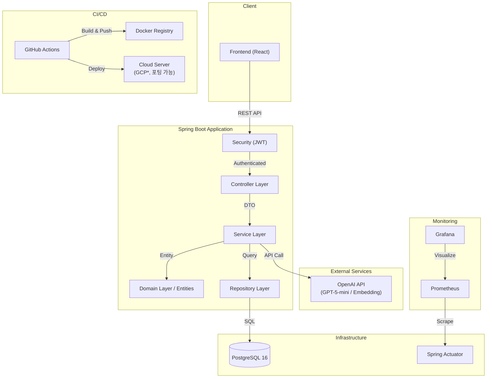
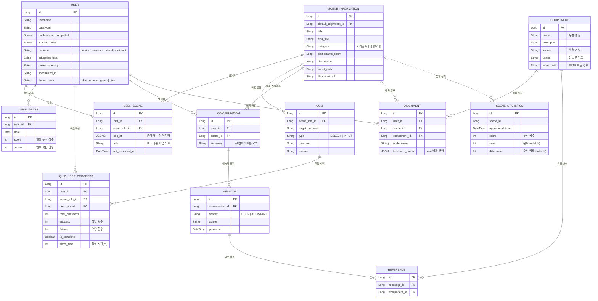

# 🌐 SIMVEX - 나에게 쉽게 보이는, 3D 학습 플랫폼

> 이 프로젝트는 2026년 `제4회 2026 블레이버스 MVP 개발 해커톤` 에서 아이템1 부문에서 `대상`을 수상한 프로젝트입니다.

**공학 학습과 연구를 하나로 잇는 3D 시각화·시뮬레이션 플랫폼**

SIMVEX는 3D 모델을 인터랙티브하게 탐색하고, AI 어시스턴트와 함께 학습하며, 퀴즈로 이해도를 확인할 수 있는 플랫폼입니다.

본 저장소는 비즈니스 로직과 데이터 관리를 담당하는 **백엔드 서버 프로젝트**입니다.


---

## 📌 목차

- [주요 기능](#-주요-기능)
- [기술 스택](#-기술-스택)
- [시작하기](#-시작하기)
- [시스템 아키텍처](#-시스템-아키텍처)
- [데이터 모델 (ERD)](#-데이터-모델-erd)
- [API 엔드포인트](#-api-엔드포인트)
- [프로젝트 구조](#-프로젝트-구조)
- [환경 설정](#️-환경-설정)
- [테스트](#-테스트)

---

## 🎯 주요 기능

SIMVEX 백엔드가 제공하는 핵심 기능입니다. 각 기능의 세부 구현 사항은 서비스별 README를 참고하세요.

| 기능                    | 설명                                                                              | 서비스 README                                                        |
| :---------------------- | :-------------------------------------------------------------------------------- | :------------------------------------------------------------------- |
| **🔐 인증 & 온보딩**    | JWT 기반 로그인, 사용자 프로필(페르소나·학습레벨·선호 카테고리) 온보딩            | [AuthService](./src/main/java/com/blaybus/backend/service/)          |
| **🧊 3D 씬 학습**       | 씬 목록 검색·필터·정렬, 상세 조회, 최근 학습 기록, 개인 학습 노트                 | [SceneService](./src/main/java/com/blaybus/backend/service/)         |
| **🤖 AI 어시스턴트**    | Scene 컨텍스트 기반 AI 대화, 대화 요약, 부품 참조 기반 질의응답 (OpenAI GPT 연동) | [ConversationService](./src/main/java/com/blaybus/backend/service/)  |
| **� 퀴즈 시스템**       | 씬별 객관식·주관식 퀴즈, AI 채점, 진척도 추적                                     | [QuizService](./src/main/java/com/blaybus/backend/service/)          |
| **🔧 씬 조립 & 동기화** | 부품(Component) 배치 정보 저장, 카메라 시점 실시간 동기화, 3D Viewer ZIP 내보내기 | [SceneAssemblyService](./src/main/java/com/blaybus/backend/service/) |
| **🌱 활동 기록 (잔디)** | 일별 학습 활동량 기록, 연속 학습 스트릭(Streak) 계산                              | [ActivityService](./src/main/java/com/blaybus/backend/service/)      |
| **🏆 씬 랭킹**          | 배치 집계 기반 인기 씬 순위, 전일 대비 순위 변동 추적                             | [SceneService](./src/main/java/com/blaybus/backend/service/)         |

---

## 🛠 기술 스택

### Core

- **Java 21**
- **Spring Boot 4.0.2**
- **Spring Data JPA**
- **Spring Security (JWT)**

### Database & Storage

- **PostgreSQL 16** (Main DB)
- **H2 Database** (Test/Dev local)

### AI & Tools

- **OpenAI API** (GPT-5-mini / text-embedding-004)
- **Lombok**
- **Gradle**

### DevOps & Monitoring

- **Docker & Docker Compose**
- **GitHub Actions** (CI/CD)
- **Prometheus & Grafana** (Monitoring)

> **참고**: 현재 배포 인프라는 GCP 기반이지만, 추후 타 클라우드로 포팅될 수 있습니다.

---

## 🚀 시작하기

### ⚠️ 필수 선행 작업

서버를 실행하기 전, 반드시 루트 디렉토리에 `.env` 파일을 생성하고 필요한 환경 변수를 설정해야 합니다.

1. `.env.template` 파일을 복사하여 `.env` 파일을 만듭니다.
2. `DB_USERNAME`, `DB_PASSWORD`, `POSTGRES_DB` 등 필수 값을 입력합니다.

```bash
cp .env.template .env
# .env 파일을 열어 값을 채워주세요
```

### 실행 방법

#### 1. 로컬 Gradle 실행

```bash
./gradlew bootRun
```

#### 2. Docker Compose 실행 (DB + 모니터링 포함 전체 환경)

```bash
docker-compose up -d
```

Docker Compose로 실행 시, 다음 서비스들이 함께 실행됩니다:

| 서비스       | 포트   | 설명                     |
| :----------- | :----- | :----------------------- |
| `web-server` | `8080` | Spring Boot 애플리케이션 |
| `db`         | `5432` | PostgreSQL 16            |
| `prometheus` | `9090` | 메트릭 수집              |
| `grafana`    | `3000` | 모니터링 대시보드        |

---

## 🏗 시스템 아키텍처

백엔드는 계층형 아키텍처(Layered Architecture)를 따르며, AI 연동과 모니터링 레이어가 통합되어 있습니다.



---

## 🗃 데이터 모델 (ERD)

전체 도메인 간의 관계를 나타낸 ERD입니다.

- 🟦 **메인 도메인**: `User`, `SceneInformation`, `Quiz` — 시스템의 핵심 엔티티
- 🟩 **보조 도메인**: `UserScene`, `UserGrass`, `QuizUserProgress`, `Conversation`, `Message` — 메인 도메인을 확장하는 관계 엔티티
- 🟨 **3D 에셋 도메인**: `Component`, `Alignment`, `Reference` — 씬 조립과 배치를 관리
- ⬜ **배치/통계 도메인** _(점선)_: `SceneStatistics` — 배치 작업으로 집계되는 통계 데이터

> 참고: 대략적인 전체 데이터모델 구성도는 [여기](./docs/datamodel.png)를 확인하세요.



---

## 🛣 API 엔드포인트

### 인증 (Auth)

| Method  | Endpoint   | Description                 |
| :------ | :--------- | :-------------------------- |
| `POST`  | `/login`   | 사용자 로그인 및 JWT 발급   |
| `PATCH` | `/onboard` | 사용자 온보딩 정보 업데이트 |

### 씬 및 학습 (Scene & Learning)

| Method | Endpoint                 | Description                        |
| :----- | :----------------------- | :--------------------------------- |
| `GET`  | `/scenes`                | 씬 목록 조회 (검색/필터/정렬 가능) |
| `GET`  | `/scenes/{sceneId}`      | 특정 씬 상세 정보 조회             |
| `GET`  | `/scenes/ranks`          | 인기 씬 랭킹 조회                  |
| `GET`  | `/my/recent/scenes`      | 나의 최근 학습 씬 조회             |
| `GET`  | `/scenes/{sceneId}/note` | 나의 학습 노트 조회                |
| `PUT`  | `/scenes/{sceneId}/note` | 나의 학습 노트 저장/수정           |

### AI 대화 (Conversation)

| Method | Endpoint                                  | Description                             |
| :----- | :---------------------------------------- | :-------------------------------------- |
| `GET`  | `/scenes/{sceneId}/conversation`          | 대화 내역 조회 (커서 기반 페이지네이션) |
| `POST` | `/scenes/{sceneId}/conversation/messages` | AI에게 메시지 전송 및 응답 수신         |
| `GET`  | `/conversations/summary`                  | 전체 대화 내역 요약 조회                |

### 퀴즈 (Quiz)

| Method  | Endpoint                                   | Description                   |
| :------ | :----------------------------------------- | :---------------------------- |
| `GET`   | `/scenes/{sceneId}/quizzes`                | 씬별 퀴즈 목록 및 진행률 조회 |
| `POST`  | `/scenes/{sceneId}/quizzes/{quizId}/grade` | 퀴즈 정답 채점                |
| `PATCH` | `/scenes/{sceneId}/quizzes/progress`       | 퀴즈 학습 진척도 동기화       |

### 활동 기록 (Activity)

| Method | Endpoint       | Description                        |
| :----- | :------------- | :--------------------------------- |
| `GET`  | `/my/activity` | 월간 활동량 및 스트릭(Streak) 조회 |

### 에셋 및 동기화 (Assembly & Sync)

| Method | Endpoint                   | Description               |
| :----- | :------------------------- | :------------------------ |
| `POST` | `/scenes/assembly`         | 씬 조립 정보 저장         |
| `PUT`  | `/scenes/{sceneId}/sync`   | 씬 상태(카메라 등) 동기화 |
| `GET`  | `/scenes/{sceneId}/viewer` | Viewer 에셋 ZIP 내보내기  |

---

## 📁 프로젝트 구조

```text
src/main/java/com/blaybus/backend/
├── config/         # 인프라 설정 (Security, Web, OpenAI, Swagger 등)
├── controller/     # REST 컨트롤러 계층
├── domain/         # 도메인 모델 및 엔티티
│   ├── alignment/  #   부품 배치 (Alignment, Component)
│   ├── conversation/ # AI 대화 (Conversation, Message, Reference)
│   ├── quiz/       #   퀴즈 (Quiz, QuizUserProgress)
│   ├── scene/      #   씬 (SceneInformation, UserScene, SceneStatistics)
│   └── user/       #   사용자 (User, UserGrass)
├── dto/            # 데이터 전송 객체 (Request/Response)
├── exception/      # 예외 처리 및 에러 코드 정의
├── loader/         # 데이터 초기 로딩
├── repository/     # 데이터 접근 계층 (Spring Data JPA)
├── security/       # 인증/인가 관련 로직 (JWT, UserDetails)
└── service/        # 비즈니스 로직 및 외부 API 연동
```

---

## ⚙️ 환경 설정

`.env.template` 파일을 참조하여 `.env` 파일을 생성합니다.

### 🔑 로컬 실행 필수 항목

```env
# Database
DB_USERNAME=your_db_user
DB_PASSWORD=your_db_password
POSTGRES_DB=blaybus
```

### 🔐 애플리케이션 설정 (docker-compose 환경 시 필요)

```env
# Security
JWT_SECRET_KEY=your_very_long_secret_key_here
JWT_EXPIRATION_TIME=3600000

# AI
OPENAI_API_KEY=sk-....

# CORS
CORS_ALLOWED_ORIGINS=http://localhost:3000

# Docker
DOCKER_USERNAME=your_dockerhub_id
```

### 🏗 CI/CD 전용 (GitHub Actions Secrets)

> 아래 항목들은 로컬 실행에 불필요하며, GitHub Actions에서만 사용됩니다.

```env
GCP_SA_KEY=           # GCP 서비스 계정 키
GCP_PROJECT_ID=       # GCP 프로젝트 ID
DOCKER_TOKEN=         # Docker Hub 토큰
SSH_HOST=             # 배포 서버 호스트
SSH_USERNAME=         # 배포 서버 사용자명
SSH_PRIVATE_KEY=      # 배포 서버 SSH 키
```

---

## 🧪 테스트

### 테스트 실행

```bash
./gradlew test
```

### 주요 테스트 케이스 목록

<details>
<summary>테스트 케이스 상세 보기</summary>

- **Integration Tests** (통합 테스트)
  - `SceneAssemblyIntegrationTest`: 씬 조립 및 에셋 생성 통합 검증
  - `UserSceneNoteIntegrationTest`: 사용자 노트 저장 및 조회 흐름 검증
- **Verification & Manual Tests** (수동 검증)
  - `ManualVerificationExportTest`: 실제 클라이언트에 전달되는 GLTF 에셋을 생성하여 조립 상태를 수동으로 검증
  - `ManualVerificationSyncTest`: 실시간 동기화 로직 및 상태 수동 검증
- **Scenario Tests** (시나리오/Usecase 테스트)
  - `AuthTest`, `OnboardTest`: 실 서비스 시나리오(로그인, 온보딩 등) 기반의 흐름 검증
- **Service Tests** (비즈니스 로직 테스트)
  - `AuthServiceTest`: 로그인 및 JWT 발급 로직
  - `QuizServiceTest`: 퀴즈 진척도 및 결과 처리
  - `SceneServiceTest`: 씬 목록 검색 및 랭킹 정렬 로직
  - `ActivityServiceTest`: 스트릭(Streak) 계산 및 활동 로그 기록
- **Domain Tests** (단위 테스트)
  - 엔티티별 비즈니스 메서드 및 유효성 검증
  </details>
