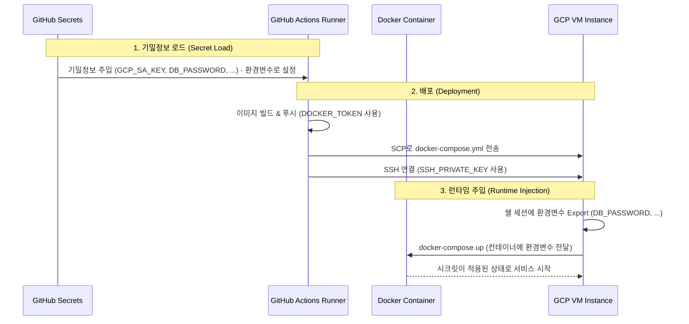

# ADR-004: GitHub Actions 기반 배포 파이프라인 구축 전략

## Status

Proposed

## Date

2026-02-01

## Context

[ADR-003](003-adopt-docker-containerization.md)에 따라 애플리케이션의 컨테이너화가 결정되었습니다.
이제 개발자가 매번 수동으로 서버에 접속하여 배포하는 비효율을 제거하고, `main` 브랜치 변경 사항을 운영 환경(GCP VM)에 즉시 반영할 수 있는 **자동화된 배포 파이프라인(CI/CD)**이 필요합니다.

GCP VM 인스턴스는 이미 존재하며, 보안과 편의성을 고려한 접근 제어 및 이미지 관리 전략이 요구됩니다.

## Decision

우리는 **GitHub Actions**를 사용하여 CI/CD 파이프라인을 구축하고, **Docker Hub**와 **SSH**를 이용해 배포하기로 결정했습니다.

구체적인 전략은 다음과 같습니다:

1.  **CI/CD 도구: GitHub Actions**
    - 저장소와 통합이 쉽고 별도의 CI 서버 구축 비용이 없습니다. (`.github/workflows/deploy.yml`로 관리)

2.  **Container Registry: Docker Hub**
    - GCP Artifact Registry 대신 설정이 간편하고 범용적인 Docker Hub를 사용합니다.
    - Public/Private Repository 활용이 용이하며, GitHub Actions의 `docker/login-action`과 호환성이 좋습니다.

3.  **인증 및 보안 (Authentication)**
    - **GCP 인증**: **Service Account Key (JSON)** 방식을 사용합니다. Key 파일 내용은 GitHub Repository Secrets(`GCP_SA_KEY`)에 암호화하여 저장하고, CI 실행 시 환경변수로 주입받습니다.
    - **VM 접근**: 별도의 Password 인증 대신 **SSH Key Authentication**을 사용합니다. (`SSH_PRIVATE_KEY` Secret 활용)

4.  **배포 방식 (Deployment Strategy)**
    - 이 방식은 VM에 별도의 에이전트(예: Kubernetes Kubelet 등) 설치가 필요 없어 구조가 단순하고 관리가 용이합니다.

5.  **Secret 주입 워크플로우 (Secret Injection Workflow)**
    - 보안 정보(Key, Password, Token 등)는 저장소에 커밋되지 않고, 실행 시점에 메모리(Env)를 통해 안전하게 전달됩니다.

## Trade-off Analysis

### 1. GCP Service Account Key vs Workload Identity Federation (WIF)

- **Service Account Key (선택됨)**
  - **장점**: 설정이 직관적이고 빠릅니다. 현재 단계에서는 개발 편의성과 신속한 적용이 최우선이므로 이 방식을 선택했습니다.
  - **단점**: Key 파일 유출 시 보안 위험이 있으며, 주기적인 Rotation이 권장됩니다. (GitHub Secrets로 관리하여 위험 완화)
- **Workload Identity Federation (WIF)**
  - **장점**: Key 파일(Long-lived credentials)을 생성하지 않아 보안상 안전합니다.
  - **단점**: GCP IAM 및 Pool 설정 등 초기 구성 복잡도가 높습니다.

### 2. Docker Hub vs GCP Artifact Registry (GAR)

- **Docker Hub (선택됨)**
  - **장점**: 특정 Cloud 벤더(GCP)에 대한 종속성을 제거할 수 있습니다. 이는 추후 타 클라우드나 온프레미스로 VM을 이관해야 할 경우 레지스트리 변경 없이 유연하게 대처하기 위함입니다.
  - **단점**: 무료 플랜 사용 시 Rate Limit이 존재할 수 있습니다.
- **GAR**
  - **장점**: GCP 내부 네트워크를 사용하여 속도가 빠르고 보안 통합이 강력합니다.
  - **단점**: GCP 전용 설정이 필요하며 플랫폼 의존성이 높아집니다.

## Consequences

- `main` 브랜치에 코드가 푸시되면 자동으로 빌드 및 배포가 수행됩니다.
- 배포를 위해 로컬에서 빌드할 필요가 없어지며, 환경 일관성이 보장됩니다.
- GCP Service Account Key와 SSH Key의 주기적인 관리(Rotation 등)가 필요합니다.
- `docs/adr/004-establish-deployment-pipeline-with-github-actions.md` 파일로 이 결정사항이 관리됩니다.
