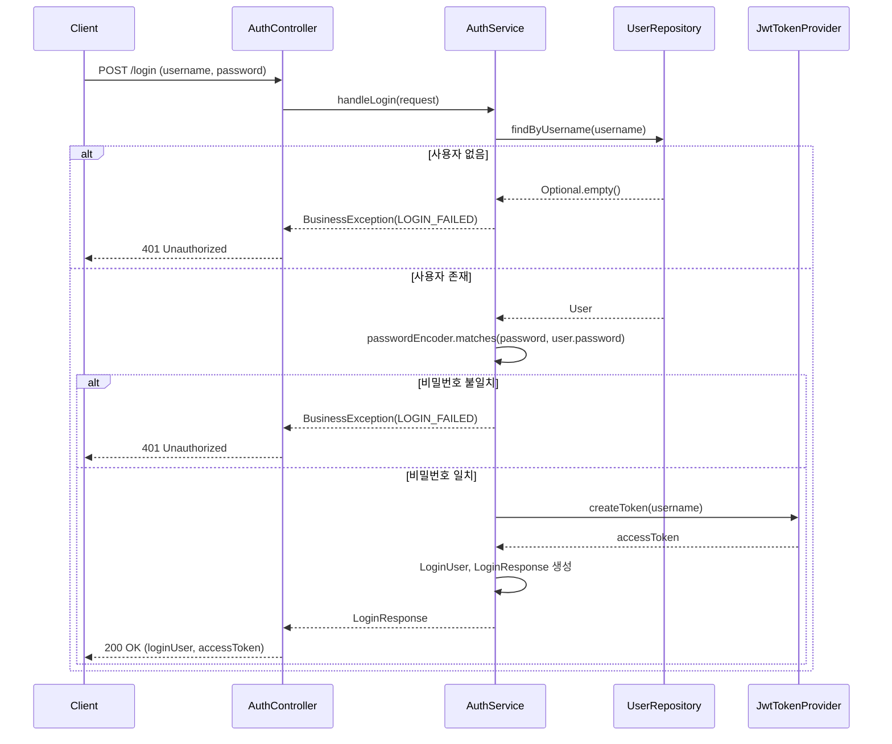

# 🔐 로그인 기능 명세

## 1. Overview

사용자가 `username`과 `password`를 사용하여 시스템에 접속하고, JWT Access Token을 발급받는 과정.
인증 성공 시 사용자 정보와 토큰을 함께 반환하여 클라이언트가 온보딩 완료 여부를 판단할 수 있도록 한다.

## 2. API 명세

### Endpoint

```
POST /login
```

### Request Body

| 필드명     | 타입   | 필수여부 | 유효성 검사 규칙 (Validation)          |
| :--------- | :----- | :------- | :------------------------------------- |
| `username` | string | Yes      | `@NotBlank` - 빈 값 불가               |
| `password` | string | Yes      | `@NotBlank`, `@Size(min=6)` - 6자 이상 |

**Request 예시:**

```json
{
  "username": "admin",
  "password": "admin1234!"
}
```

### Response Body

| 필드명                      | 타입    | 설명                                          |
| :-------------------------- | :------ | :-------------------------------------------- |
| `loginUser`                 | object  | 로그인한 사용자 정보                          |
| `loginUser.username`        | string  | 사용자 아이디                                 |
| `loginUser.name`            | string  | 사용자 이름 (null 가능)                       |
| `loginUser.isFinishOnboard` | boolean | 온보딩 완료 여부 (`false`면 온보딩 화면 이동) |
| `accessToken`               | string  | JWT Access Token                              |

**Response 예시 (200 OK):**

```json
{
  "loginUser": {
    "username": "admin",
    "name": "관리자",
    "isFinishOnboard": false
  },
  "accessToken": "eyJhbGciOiJIUzI1NiIsInR5cCI6IkpXVCJ9..."
}
```

## 3. 동작 로직 (Business Logic)



### 주요 처리 단계

1. **사용자 조회**: `username`으로 DB에서 사용자 검색
2. **비밀번호 검증**: BCrypt 인코더로 입력된 비밀번호와 저장된 해시 비교
3. **토큰 생성**: JWT Access Token 발급
4. **응답 구성**: 사용자 정보(`LoginUser`)와 토큰을 포함한 `LoginResponse` 반환

## 4. 클라이언트 처리 가이드

### Access Token 사용

모든 인증이 필요한 API 요청 시 헤더에 토큰을 포함:

```http
Authorization: Bearer ${accessToken}
```

### 온보딩 분기 처리

```javascript
if (!response.loginUser.isFinishOnboard) {
  // 온보딩 화면으로 이동
  router.push("/onboarding");
} else {
  // 메인 화면으로 이동
  router.push("/dashboard");
}
```

## 5. 예외 처리 (Edge Cases)

| 상황                  | HTTP Status | 응답 코드             | 사용자 메시지                               |
| :-------------------- | :---------- | :-------------------- | :------------------------------------------ |
| 사용자를 찾을 수 없음 | 401         | `LOGIN_FAILED`        | "아이디 또는 비밀번호가 올바르지 않습니다." |
| 비밀번호 불일치       | 401         | `LOGIN_FAILED`        | "아이디 또는 비밀번호가 올바르지 않습니다." |
| 유효성 검사 실패      | 400         | `INVALID_INPUT_VALUE` | 필드별 검증 메시지                          |

> [!NOTE]
> 보안을 위해 사용자가 존재하지 않는 경우와 비밀번호가 틀린 경우 동일한 에러 메시지를 반환합니다.

## 6. 관련 파일

| 파일                    | 역할                       |
| :---------------------- | :------------------------- |
| `AuthController.java`   | 로그인 API 엔드포인트 정의 |
| `AuthService.java`      | 로그인 비즈니스 로직       |
| `AuthDto.java`          | Request/Response DTO 정의  |
| `JwtTokenProvider.java` | JWT 토큰 생성 및 검증      |
| `User.java`             | 사용자 엔티티              |

## 7. 🤖 AI Guidelines (Instructions)

> AI는 로그인 관련 코드를 작성할 때 다음 규칙을 준수해야 한다.

1. **응답 형식 유지**: `loginUser`와 `accessToken`을 포함한 현재 응답 구조를 유지한다.
2. **필드명 주의**: JSON 필드명은 camelCase를 사용하며, `isFinishOnboard`와 같이 boolean 필드는 `is` prefix를 사용한다.
3. **에러 처리 일관성**: 인증 실패 시 세부 원인을 노출하지 않고 동일한 에러 메시지를 반환한다.
