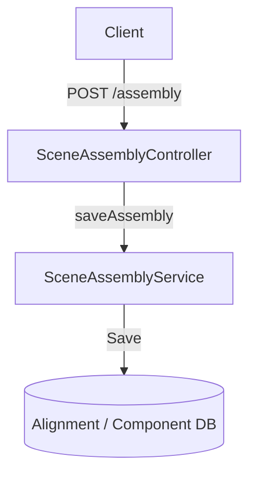

# 🏗️ Scene Assembly API 명세

## 1. 개요

사용자가 3D Scene의 초기 조립 정보를 서버에 저장하기 위한 API입니다.

## 2. API 명세

### 2.1 Scene 조립 정보 저장

초기 씬 구성 정보(각 노드의 위치, 계층 구조 등)를 DB에 저장합니다.

- **Endpoint**: `POST /scenes/assembly`
- **Request Headers**:
  ```http
  Content-Type: application/json
  Authorization: Bearer {JWT_TOKEN}
  ```

#### Request Body (`SceneAssemblyDto`)

| 필드명  | 타입   | 설명                                |
| :------ | :----- | :---------------------------------- |
| `file`  | String | 에셋 경로 (예: `Drone/Drone.gltf`)  |
| `nodes` | Array  | 노드 정보 리스트 (`SceneNodeDto[]`) |

#### SceneNodeDto

| 필드명     | 타입   | 설명                                 |
| :--------- | :----- | :----------------------------------- |
| `name`     | String | 노드 이름 (예: `Arm_gear1`)          |
| `matrix`   | Array  | 4x4 변환 행렬 (16개의 Double 리스트) |
| `children` | Array  | 자식 노드의 인덱스 리스트 (필요 시)  |

#### Request Example

```json
{
  "file": "Drone/Drone.gltf",
  "nodes": [
    {
      "name": "Arm_gear1",
      "matrix": [1, 0, 0, 0, 0, 1, 0, 0, 0, 0, 1, 0, 0, 0, 0, 1],
      "children": []
    }
  ]
}
```

## 3. 동작 로직



## 4. 관련 문서

- [Scene Sync API 명세](./scene_sync.md)
- [Scene Viewer ZIP 내보내기 명세](./viewer_export.md)
