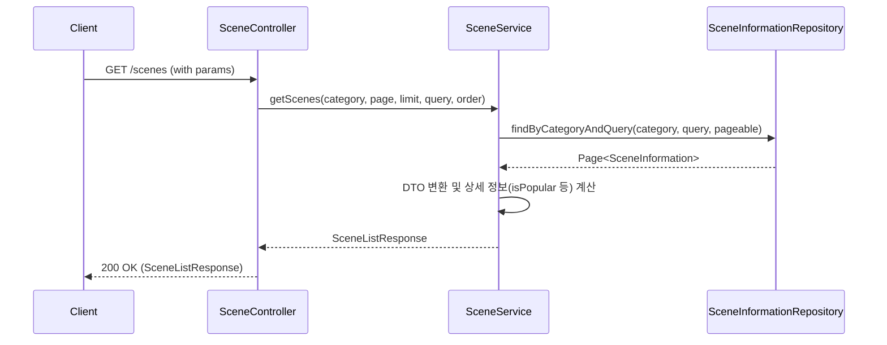

# 📝 오브젝트 리스트 조회 기능 명세

## 1. Overview

사용자가 다양한 학습 오브젝트(Scene)를 검색어, 카테고리별로 탐색하고, 페이지네이션과 정렬 기능을 통해 원하는 리스트를 확인할 수 있는 기능을 제공한다.

## 2. API 명세

### Endpoint

```
GET /scenes
```

### Headers

```
Authorization: Bearer ${accessToken}
```

### Query Parameters

| 파라미터   | 타입   | 필수여부 | 기본값        | 설명                                                      |
| :--------- | :----- | :------- | :------------ | :-------------------------------------------------------- |
| `category` | enum   | No       | -             | `SceneCategory` (robotics, automotive_engineering 등)      |
| `page`     | int    | No       | `1`           | 조회할 페이지 번호 (1부터 시작)                            |
| `limit`    | int    | No       | `9`           | 페이지당 항목 수                                          |
| `query`    | string | No       | -             | 검색어 (제목 및 영어 제목 포함 여부 확인)                 |
| `order`    | enum   | No       | `alphabetical`| 정렬 순서 (`alphabetical`: 가나다순, `popularity`: 인기순) |

### Response Body

```json
{
  "totalPages": 5,
  "scenes": [
    {
      "id": "1",
      "isPopular": true,
      "title": "로봇 팔(Robot Arm)",
      "engTitle": "Robot Arm",
      "category": "robotics",
      "description": "산업용 로봇 팔의 구조와 원리를 학습합니다.",
      "imageUrl": "https://example.com/image.png",
      "participantsCount": 120
    }
  ]
}
```

## 3. 동작 로직 (Business Logic)



### 주요 처리 단계

1.  **파라미터 변환**: `page` 파라미터를 Spring Data의 0-based index로 변환 (page - 1).
2.  **정렬 로직**:
    *   `alphabetical`: `title` 컬럼 기준 오름차순.
    *   `popularity`: `participantsCount` 컬럼 기준 내림차순.
3.  **검색 및 필터링**: `SceneInformationRepository`에서 `LIKE %query%`를 사용하여 제목(title) 또는 영어 제목(engTitle)에 키워드가 포함된 항목을 검색하며, 카테고리가 지정된 경우 해당 카테고리만 필터링한다.
4.  **인기 여부 판단**: `participantsCount >= 5`인 경우 `isPopular`를 `true`로 설정한다. (ADR 010 참고)

## 4. 예외 처리 (Edge Cases)

| 상황               | HTTP Status | 응답 코드           | 사용자 메시지                   |
| :----------------- | :---------- | :------------------ | :------------------------------ |
| 인증 토큰 없음     | 401         | `UNAUTHORIZED`      | "인증이 필요합니다."            |
| 잘못된 카테고리 값 | 400         | `INVALID_PARAMETER` | "파라미터가 유효하지 않습니다." |
| 잘못된 정렬 값     | 400         | `INVALID_PARAMETER` | "파라미터가 유효하지 않습니다." |

## 5. 관련 파일

| 파일                           | 역할                                   |
| :----------------------------- | :------------------------------------- |
| `SceneController.java`         | 리스트 조회 엔드포인트 정의            |
| `SceneService.java`            | 페이징, 정렬, 검색 비즈니스 로직       |
| `SceneInformationRepository.java`| JPQL을 이용한 동적 쿼리 처리           |
| `SceneListResponse.java`       | 응답 DTO                               |
| `SceneListOrder.java`          | 정렬 순서 Enum                         |
| `SceneCategory.java`           | 오브젝트 카테고리 Enum                 |
| `SceneInformation.java`        | 오브젝트 엔티티                        |
| `SceneListOrderConverter.java` | String 파라미터를 Enum으로 변환하는 컨버터 |

## 6. 🤖 AI Guidelines (Instructions)

1.  **정렬 확장**: 새로운 정렬 조건이 추가될 경우 `SceneListOrder` Enum에 추가하고 `SceneService`에서 해당 `Sort` 객체 생성 로직을 업데이트해야 한다.
2.  **검색 성능**: 현재 `LIKE %query%` 방식을 사용하므로 데이터가 많아질 경우 성능 최적화(Full-text search 등)가 필요할 수 있다.
3.  **인증 필수**: 모든 오브젝트 조회 API는 JWT 인증을 거쳐야 한다.
