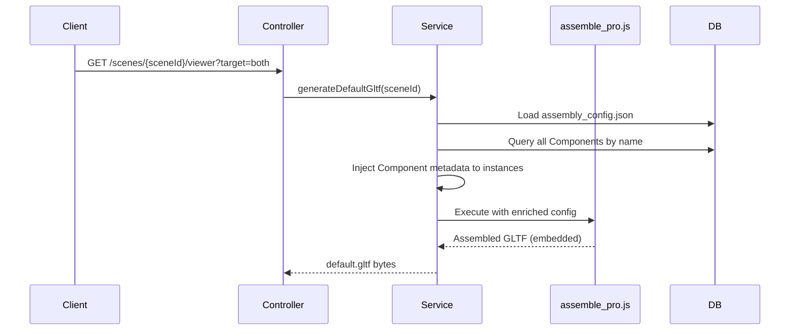
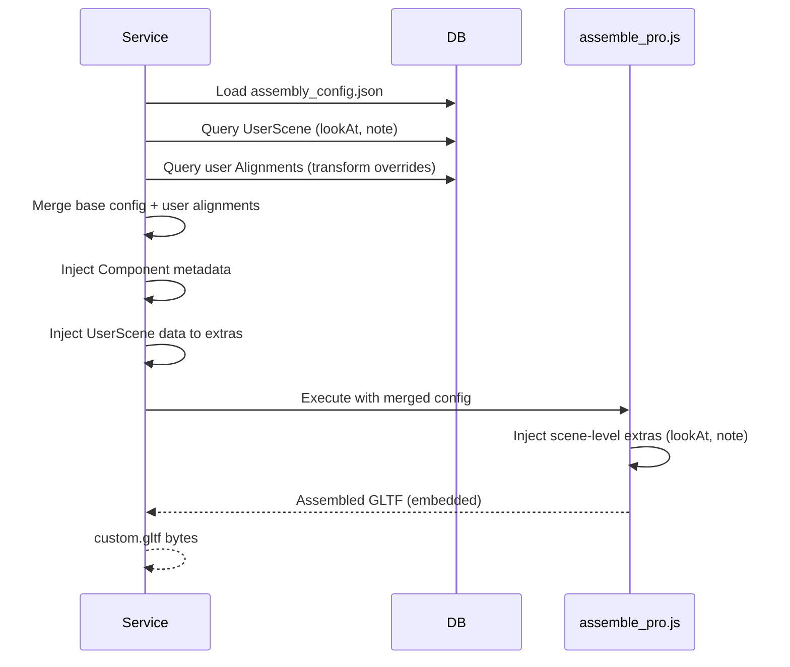

# 🎬 Scene Viewer ZIP Export 명세

## 1. Overview

사용자가 3D Scene을 독립적으로 실행 가능한 Viewer ZIP 파일로 내보낼 수 있는 기능입니다.

- **default.gltf**: 사용자 수정 없이 base config 기반으로 조립된 GLTF (메타데이터 포함)
- **custom.gltf**: 사용자의 정렬 변경사항(Alignment)과 카메라 설정(UserScene)을 반영한 GLTF
- **manifest.json**: Viewer 설정 파일

## 2. API 명세

### Endpoint

```
GET /scenes/{sceneId}/viewer
```

### Query Parameters

| 필드명   | 타입   | 필수여부 | 설명                                                        |
| :------- | :----- | :------- | :---------------------------------------------------------- |
| `target` | string | No       | 내보내기 대상: `default`, `custom`, `both` (기본값: `both`) |

### Response

| 필드명      | 타입         | 설명                       |
| :---------- | :----------- | :------------------------- |
| (응답 본문) | octet-stream | ZIP 파일 (application/zip) |

**Response Headers:**

```
Content-Type: application/zip
Content-Disposition: attachment; filename="viewer_assets.zip"
```

**ZIP 구조:**

```
viewer_assets.zip
├── default.gltf        # Base config 기반 조립 GLTF
├── custom.gltf         # 사용자 정렬 + 카메라 반영 GLTF
└── manifest.json       # Viewer 설정
```

## 3. 동작 로직 (Business Logic)

### 3.1 Default GLTF 생성 (`generateDefaultGltf`)



**핵심 처리:**

1. `assembly_config.json`에서 base instances 로드
2. 각 instance의 `assetId`로 Component 조회
3. Component 메타데이터(`description`, `usage`, `texture`, `dbId`)를 `extras`에 주입
4. `assemble_pro.js`로 GLTF 조립 및 최적화

### 3.2 Custom GLTF 생성 (`exportAssembledGltf`)



**핵심 처리:**

1. `assembly_config.json` base instances 로드
2. **Base config의 `assets` 맵을 `assetsMap`에 복사** (파일명 매핑 보장)
3. User `Alignment`를 nodeNam으로 인덱싱
4. Base instances를 순회하며:
   - User alignment가 있으면 transform matrix 오버라이드
   - Component 조회 후 메타데이터 주입
5. `UserScene`의 `lookAt`/`note`를 top-level `extras`로 전달
6. `assemble_pro.js`가 Scene 객체에 `extras.lookAt`, `extras.note` 주입

### 3.3 AssemblePro.js 처리

```javascript
// 1. Asset Loading
const assetCache = new Map();
for (const assetKey of requiredAssetKeys) {
  let filename = assetMap[assetKey] || `${assetKey}.gltf`;
  const filePath = path.join(assetsDir, filename);
  if (fs.existsSync(filePath)) {
    const doc = await io.read(filePath);
    assetCache.set(assetKey, doc);
  }
}

// 2. Instance Assembly
for (const instanceInfo of assemblyData.instances) {
  const { name, assetId, matrix, extras } = instanceInfo;
  const partDoc = await cloneDocument(assetCache.get(assetId));
  const wrapperNode = partDoc.createNode(name).setMatrix(matrix);
  if (extras) wrapperNode.setExtras(extras);
  // Merge into master document
}

// 3. Scene Extras Injection
if (assemblyData.extras) {
  masterScene.setExtras(assemblyData.extras);
}
```

## 4. 데이터 구조

### 4.1 UserScene Entity

```java
@Entity
public class UserScene {
    @Id
    private Long id;

    @ManyToOne
    private User user;

    @ManyToOne
    private SceneInformation scene;

    @Column(columnDefinition = "TEXT")
    private String lookAt;  // JSON: { position: [x,y,z], target: [x,y,z] }

    @Column(length = 500)
    private String note;
}
```

### 4.2 Alignment Entity

```java
@Entity
public class Alignment {
    @Id
    private Long id;

    @ManyToOne
    private User user;

    @ManyToOne
    private SceneInformation scene;

    @ManyToOne
    private Component component;

    private String nodeName;

    @Column(columnDefinition = "TEXT")
    private String transformMatrix;  // JSON: [16 floats]
}
```

### 4.3 Assembly Config JSON

```json
{
  "assets": {
    "arm_gear": "Arm gear.gltf",
    "main_frame": "Main frame.gltf"
  },
  "instances": [
    {
      "name": "Arm_gear1",
      "assetId": "arm_gear",
      "matrix": [1, 0, 0, 0, ...]
    }
  ]
}
```

### 4.4 Custom GLTF Extras 구조

```json
{
  "scenes": [
    {
      "name": "Scene",
      "extras": {
        "lookAt": {
          "position": [10, 10, 10],
          "target": [0, 0, 0]
        },
        "note": "사용자 메모"
      },
      "nodes": [1, 3, 5, ...]
    }
  ],
  "nodes": [
    {
      "name": "Arm_gear1",
      "extras": {
        "dbId": 42,
        "description": "Drone의 arm_gear 부품입니다",
        "usage": "제조, 조립, 용접",
        "texture": "알루미늄 합금"
      },
      "matrix": [...]
    }
  ]
}
```

## 5. 기술적 고민 및 해결 과정

### 5.1 문제: Custom GLTF에서 Scene 노드 누락

**증상:**

- `custom.gltf`의 `scenes[0].nodes`에 `[1]`만 포함
- `default.gltf`는 전체 노드 `[1, 3, 5, ..., 53]` 포함
- Drone Body, Wings 등 대부분의 에셋이 렌더링 안 됨

**원인 분석:**

```java
// AS-IS (문제 코드)
List<Alignment> alignments = alignmentRepository.findByUserIdAndSceneId(userId, sceneId);
List<InstanceDto> instanceDtos = alignments.stream()
    .map(align -> mapToInstance(align))
    .collect(Collectors.toList());
```

- **사용자가 수정한 Alignments만** 조회하여 GLTF에 포함
- Base config의 unmodified 노드들은 무시됨

**해결 방법:**

```java
// TO-BE (수정 코드)
// 1. Base config 로드
Map<String, Object> baseConfig = objectMapper.readValue(
    new ClassPathResource(configPath).getInputStream(), ...);
List<Map<String, Object>> baseInstances = baseConfig.get("instances");

// 2. User alignments 인덱싱
Map<String, Alignment> alignmentMap = alignments.stream()
    .collect(Collectors.toMap(Alignment::getNodeName, Function.identity()));

// 3. Base instances 순회하며 병합
for (Map<String, Object> baseInstance : baseInstances) {
    String nodeName = baseInstance.get("name");
    if (alignmentMap.containsKey(nodeName)) {
        // User override: transform matrix 교체
        baseInstance.put("matrix", parseMatrix(alignmentMap.get(nodeName)));
    }
    finalInstances.add(baseInstance);
}
```

### 5.2 문제: Asset 파일 로딩 실패로 누락

**증상:**

- `Main frame.gltf`, `Impellar Blade.gltf` 등 미로딩
- `assemble_pro.js`가 "⚠️ Asset file not found" 경고

**원인 분석:**

```java
// AS-IS (문제 코드)
Map<String, String> assetsMap = new HashMap<>();
for (Instance instance : finalInstances) {
    Component comp = componentRepository.findByName(instance.assetId).orElse(null);
    if (comp != null) {
        assetsMap.put(comp.getName(), comp.getAssetPath());
    }
    // comp == null이면 assetsMap에 추가 안 됨!
}
```

- Component DB 조회 실패 시 `assetsMap`에 매핑 추가 안 함
- `assemble_pro.js`가 `assetsMap[assetId]`를 못 찾아 기본값 `${assetId}.gltf` 사용
- 실제 파일명은 `Main frame.gltf`인데 `main_frame.gltf` 찾음 → 실패

**해결 방법:**

```java
// TO-BE (수정 코드)
Map<String, String> assetsMap = new HashMap<>();

// 1. Base config의 assets 맵을 먼저 복사 (fallback 보장)
Map<String, String> baseAssets = baseConfig.get("assets");
if (baseAssets != null) {
    assetsMap.putAll(baseAssets);
}

// 2. Component 조회 후 override (필요 시)
for (Instance instance : finalInstances) {
    Component comp = componentRepository.findByName(instance.assetId).orElse(null);
    if (comp != null && comp.getAssetPath() != null) {
        assetsMap.put(comp.getName(), comp.getAssetPath());
    }
    // 이미 baseAssets에서 복사했으므로 DB 조회 실패해도 괜찮음
}
```

## 6. 예외 처리

| 상황                          | HTTP Status | 처리                           |
| :---------------------------- | :---------- | :----------------------------- |
| Scene이 존재하지 않음         | 500         | RuntimeException 발생          |
| Assembly config 파일 없음     | 500         | RuntimeException 발생          |
| Node.js script 실행 실패      | 500         | RuntimeException 발생          |
| UserScene 없음 (lookAt, note) | N/A         | extras 필드 생략하고 정상 처리 |

## 7. 관련 파일

| 파일                           | 역할                                             |
| :----------------------------- | :----------------------------------------------- |
| `SceneAssemblyController.java` | `/scenes/{id}/viewer` API 엔드포인트             |
| `SceneAssemblyService.java`    | GLTF 조립 비즈니스 로직 (default/custom)         |
| `assemble_pro.js`              | Node.js GLTF 조립 스크립트 (gltf-transform 사용) |
| `UserScene.java`               | 사용자별 카메라 설정 엔티티                      |
| `Alignment.java`               | 사용자별 컴포넌트 배치 엔티티                    |
| `Component.java`               | 컴포넌트 메타데이터 엔티티                       |

## 8. 🤖 AI Guidelines (Instructions)

> AI는 Scene Export 관련 코드를 작성할 때 다음 규칙을 준수해야 한다.

1. **Base Config 병합 필수**: Custom GLTF 생성 시 반드시 base config를 로드하고 user alignment를 병합해야 한다.
2. **AssetsMap 초기화**: `baseConfig.assets`를 먼저 `assetsMap`에 복사하여 파일명 매핑을 보장한다.
3. **Scene Extras 주입**: UserScene의 `lookAt`, `note`는 GLTF의 `scenes[0].extras`에 주입한다.
4. **Node Extras 주입**: Component 메타데이터는 개별 노드의 `extras`에 주입한다.
5. **Matrix Override**: User alignment가 있는 노드만 transform matrix를 교체한다.
6. **Embedded GLTF**: 모든 GLTF는 base64 임베딩된 형태로 생성한다 (외부 .bin 파일 없음).
