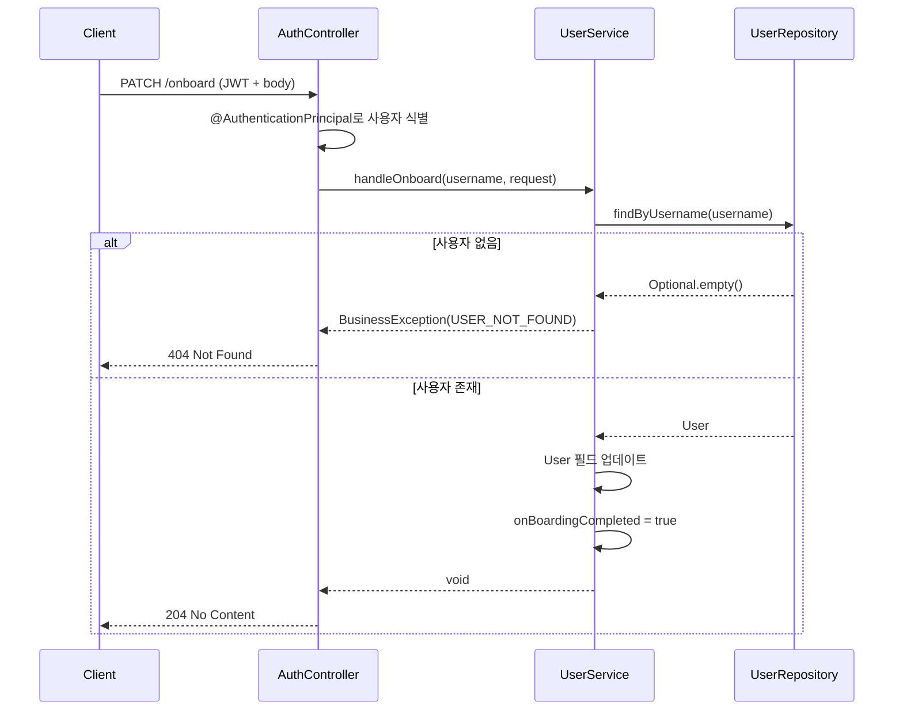

# 📝 온보딩 기능 명세

## 1. Overview

최초 로그인 후 사용자가 추가 정보(이름, 선호 학습 분야, 교육 수준, AI 어조, 테마 색상 등)를 입력하는 과정.
온보딩 완료 시 `onBoardingCompleted` 플래그가 `true`로 설정되어 이후 로그인 시 온보딩 화면을 건너뛴다.

## 2. API 명세

### Endpoint

```
PATCH /onboard
```

### Headers

```
Authorization: Bearer ${accessToken}
```

### Request Body

| 필드명           | 타입   | 필수여부 | 설명                               |
| :--------------- | :----- | :------- | :--------------------------------- |
| `name`           | string | Yes      | 사용자 성명                        |
| `preferCategory` | string | Yes      | 쉼표로 구분된 학습 분야            |
| `educationLevel` | enum   | Yes      | 교육 수준                          |
| `specialized`    | string | Yes      | 이미 잘 알고 있는 분야 (쉼표 구분) |
| `persona`        | enum   | Yes      | AI Assistant의 어조                |
| `themeColor`     | enum   | Yes      | 사용자 선호 테마 색상              |

**Enum 허용값:**

| 필드             | 허용값                                              |
| :--------------- | :-------------------------------------------------- |
| `educationLevel` | `beginner`, `fundamental`, `intermediate`, `expert` |
| `persona`        | `senior`, `professor`, `friend`, `assistant`        |
| `themeColor`     | `blue`, `orange`, `green`, `pink`                   |

**Request 예시:**

```json
{
  "name": "홍길동",
  "preferCategory": "기계공학,우주공학",
  "educationLevel": "beginner",
  "specialized": "전기공학,컴퓨터공학",
  "persona": "friend",
  "themeColor": "blue"
}
```

### Response

| 상황 | HTTP Status | 설명                        |
| :--- | :---------- | :-------------------------- |
| 성공 | 204         | No Content (응답 본문 없음) |

## 3. 동작 로직 (Business Logic)



### 주요 처리 단계

1. **사용자 식별**: JWT 토큰에서 `username` 추출 (`CustomUserDetails`)
2. **사용자 조회**: `username`으로 DB에서 사용자 검색
3. **필드 업데이트**: 요청 본문의 데이터로 User 엔티티 업데이트
4. **온보딩 완료 처리**: `onBoardingCompleted = true` 설정

## 4. 예외 처리 (Edge Cases)

| 상황                    | HTTP Status | 응답 코드           | 사용자 메시지                   |
| :---------------------- | :---------- | :------------------ | :------------------------------ |
| 인증 토큰 없음          | 401         | `UNAUTHORIZED`      | "인증이 필요합니다."            |
| 토큰 만료/유효하지 않음 | 401         | `UNAUTHORIZED`      | "인증이 필요합니다."            |
| 잘못된 Enum 값          | 400         | `INVALID_PARAMETER` | "파라미터가 유효하지 않습니다." |
| 사용자를 찾을 수 없음   | 404         | `USER_NOT_FOUND`    | "존재하지 않는 사용자입니다."   |

> [!NOTE]
> Enum 값은 소문자로 전달해야 합니다. (예: `"beginner"`, `"friend"`, `"blue"`)

## 5. 관련 파일

| 파일                          | 역할                                 |
| :---------------------------- | :----------------------------------- |
| `AuthController.java`         | 온보딩 API 엔드포인트 정의           |
| `UserService.java`            | 온보딩 비즈니스 로직                 |
| `OnboardDto.java`             | Request DTO 정의                     |
| `CustomUserDetails.java`      | JWT 인증 후 사용자 정보 저장         |
| `User.java`                   | 사용자 엔티티                        |
| `EducationLevel.java`         | 교육 수준 Enum                       |
| `Persona.java`                | AI 어조 Enum                         |
| `ThemeColor.java`             | 테마 색상 Enum                       |
| `GlobalExceptionHandler.java` | JSON 파싱 오류 처리 (Enum 변환 실패) |

## 6. 🤖 AI Guidelines (Instructions)

> AI는 온보딩 관련 코드를 작성할 때 다음 규칙을 준수해야 한다.

1. **Enum 값 일관성**: 모든 Enum은 소문자 JSON 값을 지원해야 하며, `@JsonCreator`/`@JsonValue`를 사용한다.
2. **응답 형식**: 온보딩 성공 시 반드시 `204 No Content`를 반환하며, 응답 본문을 포함하지 않는다.
3. **필드 매핑 주의**: 요청의 `specialized` 필드는 엔티티의 `specializedIn` 필드로 매핑된다.
4. **인증 필수**: 이 API는 JWT 인증이 필수이며, `CustomUserDetails`를 통해 사용자를 식별한다.
